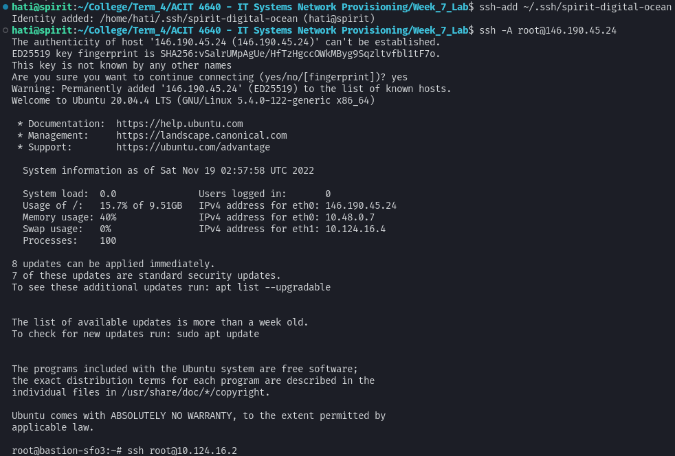
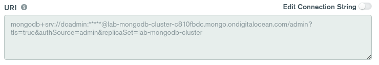
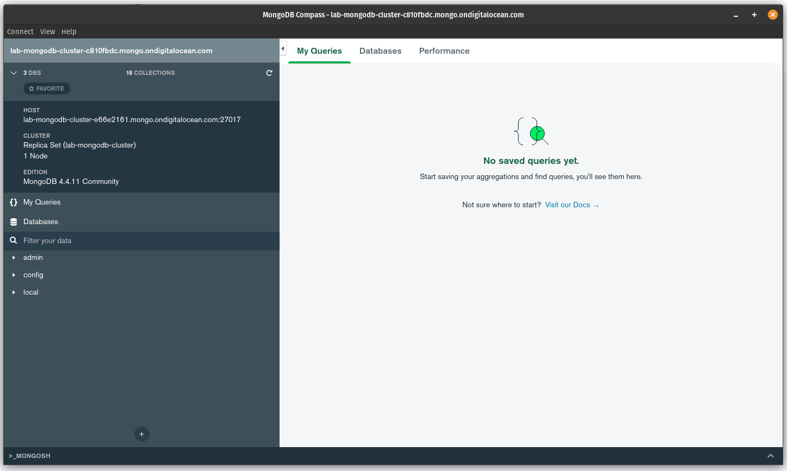

# This project creates resources on Digital Ocean and configures firewalls for them.

## Resources created

- VPC
- 3 Droplets
- 1 Bastion Droplet
- Load Balancer
- Managed MongoDB Database
- Firewalls
- Tags
- Project

### How are the resources configured?

Every resource is on the same VPC and on the Project that is created. The 3 droplets have a firewall that only allows connections from the Bastion server and HTTP/HTTPS connections. The Database is only accessible from those 3 droplets, and from the IP you configured in the `terraform.tfvars` file.

## How to run

### Initial setup:

1. Install Terraform. You can install it here: https://developer.hashicorp.com/terraform/tutorials/downloads

2. Get proper values for `terraform.tfvars` file. You will need an Access Key for Digital Ocean, and your public IP if you wish to access the database cluster from outside the network.

4. Run the following command to initialize Terraform:

```bash
terraform init
```

### Creating resources:

You can create all the resources in the file by running the following command:

```bash
terraform apply
```

#### Connecting to the droplets through the bastion

First, you have to add the key to your host machine.
```bash
ssh-add <path_to_key>
```

Then, connect to the Bastion droplet.
```bash
ssh -A root@<bastion_ip>
```
Here's a screenshot example:


Now, you can connect to the other droplets through the Bastion droplet.
```bash
ssh root@<droplet_ip>
```

Here's a screenshot example:


#### Connecting to the database cluster

I am going to use MongoDB Compass to connect to the database. If you didn't configure the `your_ip` variable, you will have to connect to it through a client on the internal droplets.

You can grab the database connection string on DigitalOcean's website, on the database cluster page.




### Destroying resources:

You can destroy all the resources in the file by running the following command:

```bash
terraform destroy
```

